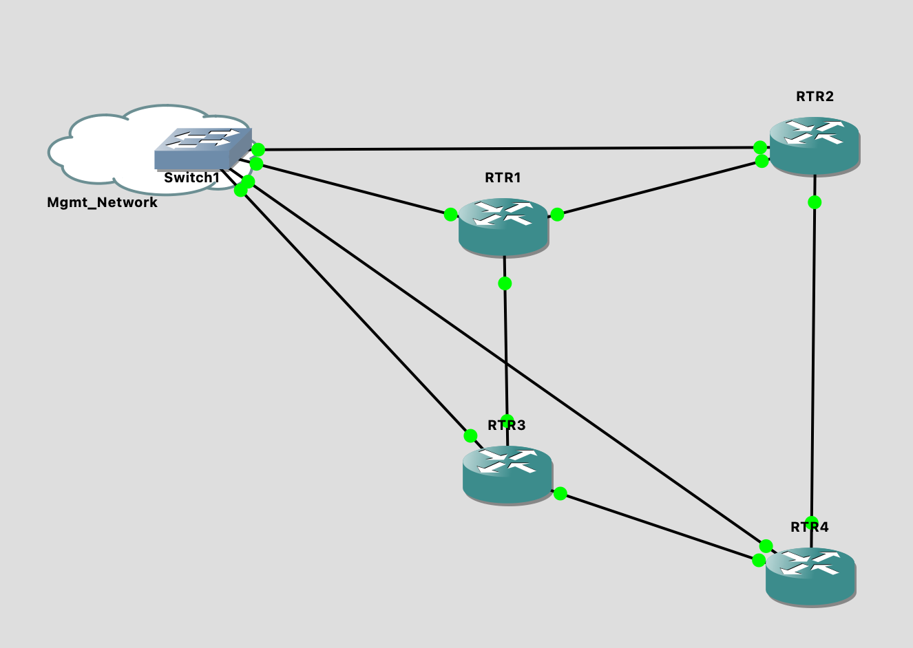
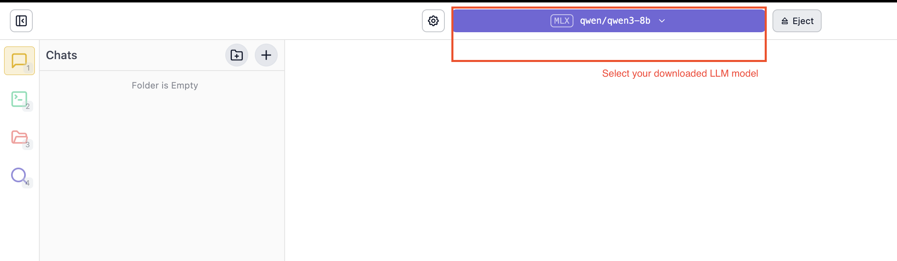
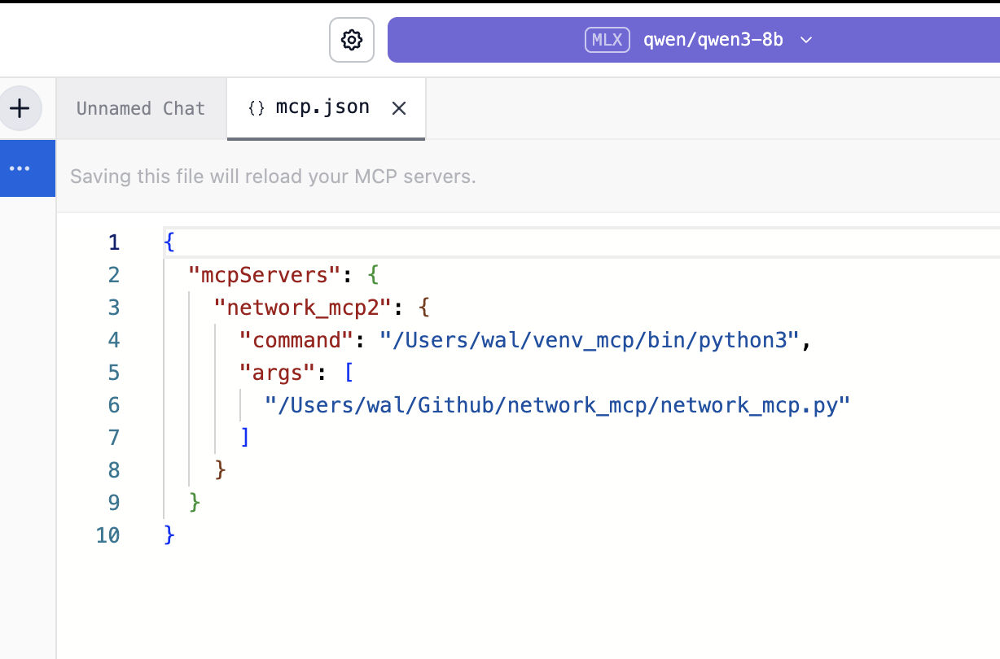
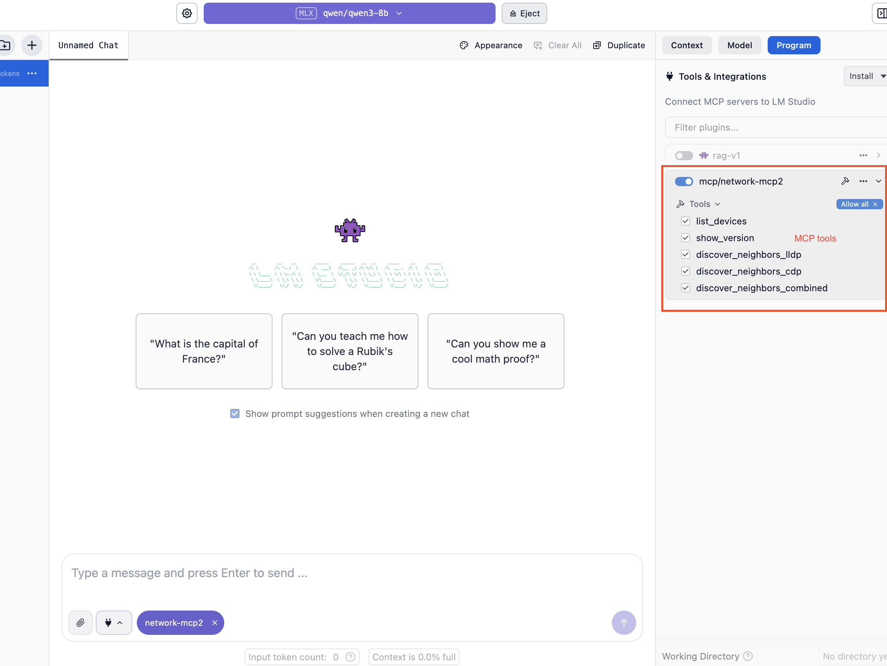

## What is MCP?

The **Model Context Protocol (MCP)** is a standard introduced in late 2024 that enables Large Language Models (LLMs) to **interact with external systems or data sources** in a structured way.

### 🔁 Bridge Analogy

To simplify:  
- on **one side** is the **LLM**, a powerful language model that understands intent, can reason, and plan in natural language.  
- On the other is your **external system** — a network environment, an API, or a data source.  
- The **MCP bridge** connects the two and defines and establishes rules of communication  — what the model can ask, how to ask, and how responses are structured.

### Why It Matters

This opens up and extends LLM possibilities, including:
- Learn about your environment (e.g., topology, configurations)
- Propose or simulate network actions
- Interact dynamically based on feedback
- Adapt its behavior to your infrastructure

It’s like giving the AI an ability to extend itself to communicate to your particular world.

---

## 🏗️ Setup Overview

Using the bridge analogy, we’ll build the AI+MCP+Network environment with three major components:

1. **Network Environment**  
   A simulated or real network for the LLM to explore and act on.  
   I used a **GNS3 virtual topology** with Cisco IOSv routers.  
   Alternatives: EVE-NG, Cisco CML, cloud labs, or physical devices.

2. **MCP Server**  
   Acts as the bridge.  
   I used a custom Python server based on [`FastMCP`](https://github.com/contextual-ai/fastmcp) to expose network functions to the LLM.

3. **LLM Interface***
   The AI brain that reasons, asks questions, and responds using plain English.
   I used LM Studio with a local model like **Qwen3-8B**   

---

## 💻 My Home Lab Setup

| Device             | Specs / Role                                   |
|--------------------|------------------------------------------------|
| **GNS3 VM**        | 16-core CPU, 64GB RAM – GNS3 host for emulation |
| **MacBook Air M2** | 24GB RAM – Hosts MCP server + LM Studio          |
| **LAN**            | Flat IP network (Mac ↔ GNS3 VM)       |

> 💡 **Tip**: You can run the entire stack on a single machine if needed.

---

## 🔧 Software & Virtual Environments

Create a dedicated Python virtual environment for the MCP server:

```bash
python3 -m venv ~/venvs/mcp
source ~/venvs/mcp/bin/activate
pip install fastmcp pyats genie
```

---

## 🛠️ Software Setup

### MCP Virtual Environment
```bash
python3 -m venv ~/venvs/mcp
source ~/venvs/mcp/bin/activate
pip install fastmcp pyats genie
```

---

## 🌐 Network Environment Setup

### Step 1 – Build a GNS3 Topology

My test topology includes:
- 4x Cisco IOSv routers
- Cloud bridge device for external connectivity
- Basic OSPF configuration across routers
- SSH enabled on each node



---

### Step 2 – Create a pyATS Testbed

pyATS helps structure network interactions. Define a `testbed.yaml` file like below:

```yaml
testbed:
  name: VirtualEnv
  credentials:
    default:
      username: '%ENV{VENV_USER}'
      password: '%ENV{VENV_USER_PASS}'
devices:
  rtr3:
    os: ios
    type: ios
    connections:
      cli:
        protocol: ssh
        ip: 192.168.178.240
  rtr1:
    os: ios
    type: ios
    connections:
      cli:
        protocol: ssh
        ip: 192.168.178.241
```

Set your environment variables:

```bash
export VENV_USER="admin"
export VENV_USER_PASS="password"
export VENV_ENABLE_PASS="password"
```

---

### Step 3 – Test Device Connectivity

```python
from genie.testbed import load

tb = load('etc/testbed.yaml')
rtr1 = tb.devices["rtr1"]
rtr1.connect()
```

---

## 🧠 Building the MCP Server

### Step 4 – Integrate pyATS with FastMCP

Your MCP server will:

- Define **tools** (Python functions)
- Register them via FastMCP
- Allow your LLM to call those tools via natural language

### Example Tool

```python

@mcp.tool()
async def list_devices() -> dict:
    """
    Retrieve a list of devices from the network testbed.

    This tool directly reads from the testbed YAML file loaded on the server.
    The user does NOT need to provide the testbed file content. Simply call this
    to retrieve all devices with metadata including OS, type, function, and management IP.


    Returns:
        dict: {
            "devices": {
                "<device_name>": {
                    "os": "<Operating System>",
                    "type": "<Device Type or Model>",
                    "function": "<Device Role or Purpose>",
                    "management_ip": "<IP Address for Management>"
                },
                ...
            }
        }
    """

    try:
        device_list = {}
        for device in testbed.devices.values():

            device_list[device.name]= {
                "os": device.os or "unknown", 
                "type": device.type  or "unknown",
                "function": getattr(device.custom, "function", "unknown"),
                "management_ip": str(getattr(device.connections.cli, "ip", "unknown"))
                }

        return {"devices": device_list}
    except Exception as e:
        return {"error": f"Failed to list devices: {str(e)}"}
```

Tools are self-documenting, allowing the LLM to know:
- Purpose of the tool
- Input needed
- Output expected
- How to use the tool

---

### ✨ Example MCP Tools created

| Tool                      | Description                             |
|---------------------------|-----------------------------------------|
| `list_devices()`          | Returns inventory info from testbed     |
| `show_version(device)`    | Runs `show version`, parsed if possible |
| `discover_neighbors_lldp()` | Uses LLDP to find neighbors            |
| `discover_neighbors_combined()` | Merges LLDP & CDP data w/ dedup  |

Remember that tools are self-documenting: the LLM learns what they do from your docstrings.

---

## 🧠 Setting Up LM Studio + Model

### Step 5 – Install UI Client

- Download from [lmstudio.ai](https://lmstudio.ai)
- Install on your local machine


### Step 6 – Load a Model

Recommended open-source models:
- **Qwen3-8B**
- **Mistral 7B**
- **DeepSeek R1**

In LM Studio:
- Pull a model, such as Qwen3-8B



---

### Step 6 - Update mcp.json

In LM Studio
- Enable **MCP mode**
- Set `mcp.json` interface to `stdio`




### Step 7 - Enable MCP Integration

Ensure MCP is enabled in LM Studio:



## 🧪 Natural Language Interaction Examples

Now that everything is wired up, you can prompt the model with natural requests like:

### 🧾 Inventory
```text
List all devices in my lab.
What routers and switches are in the testbed?
Give me each device’s OS and management IP.
```

### 🔍 Device Info
```text
Run show version on rtr1.
Get version info for rtr2.
What software is rtr3 running?
```

### 🧭 Neighbor Discovery
```text
Use LLDP to find neighbors of sw1.
Discover CDP neighbors of rtr2.
Run combined neighbor discovery on sw2.
```

### 🗺️ Topology
```text
Map the network starting from rtr1.
What is the local topology around sw1?
Who are the direct neighbors of rtr3?
```


---

## 🔁 End-to-End Workflow

Here’s how the stack flows:

```
[You] ──> [Prompt]
            │
            ▼
   [LLM in LM Studio (via stdio)]
            │
            ▼
     [MCP Server (FastAPI + FastMCP)]
            │
            ▼
     [Network Devices (SSH via pyATS)]
```

Each LLM request → invokes a tool → gets structured data → returns result.

---

## 🚀 Final Thoughts

This setup isn't just a cool experiment, but a glimpse into the **next phase of network automation** and how we will soon be interacting with network environments and devices.

It is a fundamental shift from traditional time consuming approaches such as box by box or writing custom scripts to extract and normalise the data.

What once required manual time-consuming interaction now takes a **single plain-English prompt**. This is fundamentally more flexible and scalable.

With MCP and LLMs, we will be able to:
- **Query your network in natural language**
- Let the **model interpret intent and coordinate tasks and actions**
- Get **structured output aligning to your requirement**

You're no longer tied to brittle scripts or static automation. You're building an interface where **your LLM becomes an intelligent assistant**, capable of discovering, analysing, and reasoning about your network environment in real time.

If you're serious about the future of **NetDevOps**, standing up this lab is a rewarding experience you can take.

---
## 🔮 What’s Next

In upcoming posts, I’ll explore:
- Creating **richer MCP tools and functions**
- **Building topology maps** from LLDP/CDP data
- Using LLMs to **troubleshoot connectivity issues**
- Using LLMs to **generate and validate configs**
- Testing what AI **can and can't reliably do** in network environments.

Thanks for reading — and happy experimenting.

